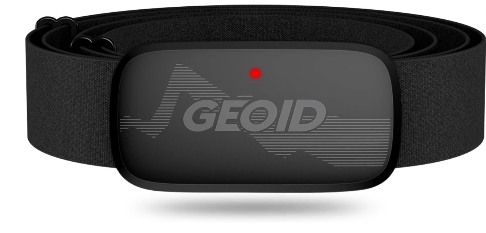
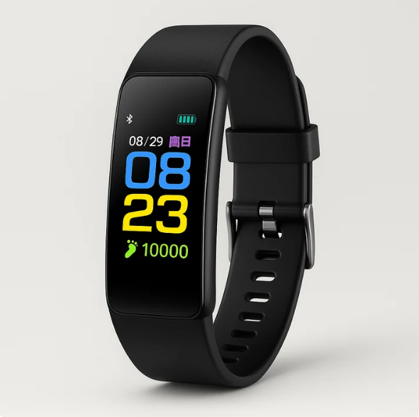

## Voice of the Customer Benchmarking

### Search #1

 **Keywords:** "Heart rate monitor"

 **Search Results Link:** <https://www.bing.com/shop/productdetails?goid=360199736964&entryPoint=genresultspage&q=heart+rate+monitor&FORM=GRPPDP>

### Selected Products

#### 1. [GEOID HS500 Heart Rate Monitor](https://www.amazon.com/GEOID-Monitor-Protocol-Bluetooth-Compatible/dp/B09SKZBZF8/ref=asc_df_B09SKZBZF8?tag=bingshoppinga-20&linkCode=df0&hvadid=80127120445046&hvnetw=o&hvqmt=e&hvbmt=be&hvdev=c&hvlocint=&hvlocphy=77723&hvtargid=pla-4583726598784020&psc=1&hvocijid=8865271711032705098-B09SKZBZF8-&hvexpln=0)

* Price: $22.99
* Vendor: Amazon
* Description: The GEOID HS500 is a chest-worn heart rate sensor designed to provide reliable heart rate data during workouts. Its updated design helps reduce interference from motion and sweat, while ANT+ and Bluetooth allow it to connect with devices and apps such as Wahoo, Zwift, Strava, and bike computers. It is lightweight, water-resistant with an IP67 rating, uses a replaceable CR2032 battery rated for up to 800 hours, and includes a one-year limited warranty.

##### Positive Comments

| Voice of the Customer         | Restated Customer Need                              |
| ----------------------------------------------------------------------------------------------------------------------------------------------------------------------------------------------------------------------------------------------------------------------------------------------------------------------------------------------------------------------------------------------------------------- | --------------------------------------------------- |
| "Simple but reliable. This inexpensive heart rate monitor matches the reading of units 10x the price, so I can say it is accurate. Connecting it up with my devices, my phone and the gym was really easy. Now I get my data synchronized with my apps (via Bluetooth) and the gym system (via ANT+). It is also pretty rugged, so you don't have to worry about hitting it while moving the dumbbells or plates" | 1. Reliable and cost efficient (explicit)           |
|                                                                                                                                                                                                                                                                                                                                                                                                                   | 2. low price for quality ( explicit)                |
| "Works great for zwift, zwift recognizes this heart rate monitor quickly."                                                                                                                                                                                                                                                                                                                                        | 1. very easy to connect with app (explicit)         |
| "Very happy with this heart rate monitor. Pairing was quick and stable with my cycling computer, and the readings have been accurate during both indoor and outdoor rides. The chest strap is comfortable and doesn’t move around while riding"                                                                                                                                                                  | 1. comfortable to use indoor and outdoor (explicit) |

##### Negative Comments

| Voice of the Customer |  Restated Customer Need           |
| ---------------------------------------------------------------------------------------------------------------------------------------------------------------------------------------------------------------------------------------------------------------------------------------------------------------------------------------------------------------------------------------------------------------------- | -------------------------------- |
| "Very disappointed with this heart rate monitor. The readings are unreliable, the device is inconsistent, and I wouldn’t trust it for anything important. For a heart rate monitor, accuracy should be the bare minimum. Definitely not worth the money."                                                                                                                                                              | 1. accurate readings. (explicit) |
|                                                                                                                                                                                                                                                                                                                                                                                                                         | 2. Price efficient. (latent)     |
| "Cheap price and nice small design. However on my first cycling ride using the same route, the sensor was not consistent and wildly inaccurate. Probably got a bad batch, seems to off by 10 BPM on the low end. Seeing random +10 and -10 BPM jumps in milliseconds. Tried repositioning a bunch of different times around my chest during the rides and nothing worked. Even popped it off the chest strap briefly. " | 1. comfortable (explicit)        |
| | 2. Reinforced parts (latent)     |
| "stopped working after one week" | 1. Long-lasting |

### Search #2

 **Keywords:** "fitness watch"

 **Search Results Link:** <https://www.bing.com/search?pglt=299&q=fittness+watch&cvid=d9023c90190946349ddc39039830be9d&gs_lcrp=EgRlZGdlKgYIABBFGDkyBggAEEUYOTIGCAEQABhAMgYIAhAAGEAyBggDEAAYQDIGCAQQABhAMgYIBRAAGEAyBggGEAAYQDIGCAcQABhAMgYICBAAGEAyBggJEAAYQNIBCDc0ODdqMGo3qAIAsAIA&FORM=ANNTA1&PC=SCOODB>

### Selected Products

#### 1. [Google Fitbit Charge 6](https://store.google.com/us/product/fitbit_charge_6?hl=en-US&utm_source=fitbit_redirect&utm_medium=google_ooo&utm_campaign=category&pli=1)

* Price: $119.95
* Vendor: Google Store
* Description: The Fitbit Charge 6 is a premium fitness tracker with advanced health monitoring, built-in GPS, Google integration, and improved heart rate accuracy.

##### Positive Comments

| Voice of the Customer                                                                                                                                                                  | Restated Customer Need                                                              |
| -------------------------------------------------------------------------------------------------------------------------------------------------------------------------------------- | ----------------------------------------------------------------------------------- |
| "The battery life is amazing on this Fitbit Charge 6 with coral strap."                                                                                               | 1.  Reliable and cost efficient (explicit)                                          |
| "I upgraded from the Charge. What I like about the Charge 6: - Great price"   | 2. Low price for quality (explicit) |
| "Works great with the app. The connection is swift and easy and the things it tracks is supurb"        | 1.  Very easy to connect with app (explicit)                                        |
| "I have had a couple of different types of Fitbit trackers over the last several years. This one has been the best one yet because it is very comfortable to wear even while sleeping."              | 1.  Comfortable to use during the night (explicit)                               |

##### Negative Comments

| Voice of the Customer                                                                                                            | Restated Customer Need           |
| -------------------------------------------------------------------------------------------------------------------------------- | -------------------------------- |
| "The heart rate is slow and laggy"                                                                                               | 1. accurate readings. (explicit) |
| "The bands always cling to my wrists to tight to where the skin rubs raw or to lose and it slides around my arm like a braclet " | 1. comfortable (explicit)        |
| | 2. Reinforced parts (latent) |
| "Major exaggeration of calories burned" | 1. Accurate calorie burn tracking | 

### Search #3

 **Keywords:** "Simple Heart Rate Monitor for Exercise"

 **Search Results Link:** <https://www.google.com/search?sca_esv=d4faa8f985ca3215&sxsrf=APpeQnsPfMQ1vcLKBBAdRfw5TRnmJGpG4w:1789446046740&q=simple+heart+rate+monitor+for+exercise&source=lnms&fbs=ABfTbFWX8Can4Rb7JjuFvBw79YrXQMyJMofRft37fxW-VQ0iJcb-TVtMT2eZIreEjxT1y-wf13Eos8r81gP3ULB-yp1wUdlcaNlA5IKel27kAstk9ijmdfJ3Ry0ifpLA4FTuP4o2kYuyi5-0GT3YTspRAvPWw9o2Jtwvia2g4YHUDQ1OlQfvjmA1WykvnkZBISRD9WMQKC2Pl2KUFtQ-MUOwzc33agYgp9duxjhnWVouxAOrt57L6bM&sa=X&ved=2ahUKEwjsjdf_3e-WAxWOmmoFHWuQKKkQ0pQJegQIDhAB&biw=1760&bih=901&dpr=1>

### Selected Products

#### 1. [Senior Fitness Tracker Watch - Heart Rate Blood Pressure LED Band](https://www.braydenandlane.com/products/senior-fitness-tracker-watch-heart-rate-blood-pressure-led-band?currency=USD&country=US&variant=58608487301494&utm_source=google&utm_medium=cpc&utm_campaign=Google%20Shopping&stkn=5d17fd197611&gad_source=1&gad_campaignid=23452101265&gbraid=0AAAABChJ29THzVDJDSV4Wx7jDSAiJPZEy&gclid=CjwKCAjwtp7VBhBjEiwAJfpV-_oDOQBLYfd7gZvmuJt0X2MLPEsApwok2_kbwT8sZd0nCLxG-ezbYxoCDBAQAvD_BwE)

* Price: $59.99

* Vendor: Brayden and Lane 

* Description: A simple, senior‑friendly fitness tracker with a large LED display, heart‑rate and blood‑pressure monitoring, step and sleep tracking, USB plug‑in charging, soft silicone band, and vibration alerts for calls, texts, meds, and inactivity. It’s designed to be easy to read, easy to use, and comfortable for all‑day wear.

##### Positive Comments

| Voice of the Customer                                                                                                                                                                  | Restated Customer Need                                                              |
| -------------------------------------------------------------------------------------------------------------------------------------------------------------------------------------- | ----------------------------------------------------------------------------------- |
| "Bought this for my 72-year-old mother and she loves it! The 0.94-inch LED screen is super clear and easy for her to read without glasses."                                                                                                  | 1. Clear Interface (explicit)|
|                                                                                                                       | 2. Easy to Navigate ( explicit) |
| "Great battery life and clear sedentary reminders to keep active during the day. Highly recommend for seniors."        | 1. Good Battery Life (explicit) |
| "Very easy health monitoring. Tracks blood pressure, heart rate, and steps accurately without complicated smartphone setup."                                                                                                                 | 1.  Works as Intended (explicit) |

##### Negative Comments

| Voice of the Customer                                                                                                                                                                                                                                                                                                                                                                                | Restated Customer Need                                  |
| ---------------------------------------------------------------------------------------------------------------------------------------------------------------------------------------------------------------------------------------------------------------------------------------------------------------------------------------------------------------------------------------------------- | ------------------------------------------------------- |
| "The silicone band that is very rough on sensitive skin."                                                              | 1. Uncomfortable (explicit)                       |
|                                                                                                                        | 2. Sensitive Skin Friendly (latent) |
| "Too expensive for what it actually is"                                                                                   | 1. Expensive (explicit) |
|                                                                                                                        | 2. Functionality does not justify price (latent) |
| "No smartphone sync features" | 1. Able to export sensor data |

### Search #4

 **Keywords:** "Heart rate monitor"

 **Search Results Link:** <https://www.amazon.com/heart-rate-monitor/s?k=heart+rate+monitor>

### Selected Products

#### 1. [KardiaMobile 6L EKG](https://www.amazon.com/KardiaMobile-Membership-Required-Unlimited-Recordings/dp/B07RQW6SD5)

* Price: $129.00

* Vendor: ALIVECOR

* Description: KardiaMobile 6L is the world’s first FDA-cleared, six-lead personal EKG. Record a medical-grade EKG in just 30 seconds and see instant results on your phone for Normal Sinus Rhythm, Atrial Fibrillation (AFib), Bradycardia, and Tachycardia.

##### Positive Comments

| Voice of the Customer | Restated Customer Need |
| --------------------- | --------------------- |
| "I've been in the clinical medical device industry for 40 years- this is a great product, that works well, and delivers clinically-valid results to your doctor; it is inexpensive and well made. No reason not to have one if you are dealing with any and all cardiac issues." | 1. Can measure clinically-valid results (explicit) |
| | 2. High manufacturing quality (explicit) |
| "I picked this up after the EKG feature on my Apple Watch stopped working, and I’m really glad I did. It gave me readings I could share with my cardiologist, which ended up helping him prescribe the right medication for my condition. That alone made it worth it." | 1. Useful for diagnosing medical conditions (explicit) |
| "I did a few test runs with this unit and shared them with a paramedic and critical care nurse. Both said the quality looked good and agreed with the device's assessment (normal rhythm)." | 1. Results can be externally validated |

##### Negative Comments

| Voice of the Customer | Restated Customer Need |
| --------------------- | --------------------- |
| "The biggest issue I have is their app constatly berates you to upgrade and buy the subscription service. Its almost difficult to use the app because the in-app advertisements and misleading pages that keep pushing the service on you even after you've told it "no". I really wish they would fix that. Its very frustrating and I almost returned the unit because of this, vut ultimately decided to keep it."  | 1. Product provides all features after initial purchase (explicit) |
| "It arrived in a box within the box a sealed package, first thing I noticed when unpacking was scratches on the back electrode. But it seems to work fine. Quality control could be better." | 1. Product is packaged with care (explicit) |
| "I've found it a bit finicky when it comes to using the ankle or knee to record an EKG. I've watched videos and read instructions in the app multiple times, thinking I must be doing something wrong. It takes a little while for me to get it working and sense my ankle/knee. This has made it extra hard for me to record said skipping heartbeat." | 1. Product works without much effort (explicit) |

### Search #5

 **Keywords:** "Heart Rate Monitor"

 **Search Results Link:** <https://www.google.com/search?sa=X&sca_esv=ec9bfc1f3b77e3d9&sxsrf=APpeQnsQ3wsGRAeVWAbd4C8nHDXeZYRpjw:1789454543644&udm=28&fbs=ABfTbFWX8Can4Rb7JjuFvBw79YrXuK78L_sHkEUm6BGU2Xt8MB1DoILzmSB4Yn2o139vCK2e3gonapooXVOEA3fRUwExu33wgP3imytGw_kr9SJRv03QDzf36Qkrgq9OIE77k4nnHGcrHcioXlPoYt8PNsFdKEawPqzXJj9jTVPQtQy29lYjeaxlHvFZ1M5hmjuGyldqvsUj9G6Q1syHNqwtN32toAk1ACa0bR_-37nYSZxj0jdfUK8&q=heart+rate+monitor&ved=1t:220175&ictx=111&biw=1259&bih=902&dpr=1>

### Selected Products

#### 1. [Rechargeable Oxygen Meter Finger Pulse Oximeter, Bluetooth Fingertip Blood Oxygen Saturation Monitor with Pulse Rate, Batteries and Lanyard Included, Free APP](https://www.amazon.com/Vibeat-Rechargeable-Bluetooth-Fingertip-Saturation/dp/B0B8SBK8LR/ref=sr_1_1_sspa?adgrpid=189931014641&dib=eyJ2IjoiMSJ9.zlIbpzdifYvr3vD4STg7Ry1wfBUIavVKPFfwnksJ14ieFqehugQUl4AhMomtO-OzPD5P-oqjmNtpgIjBCjfqvVOJt6QvZNK8XN6hL-D8wiDoJqqDUYVG0qaTdxirpxs6waaTAdQCO_Sj3qtFkuPT9IjwA8j9Tf3G5w3fZk0dOZUKNbaASEu0iKkMHmoKJZDXOK9QsmzZ-eIYQgDu4TAuG5It9MmnBKwcvwtKammdVzD401X41Qnn1nSMSoh37CsrZDpxAhKlc3ae9_0CN0kG9nrJjLOYCWp1g5wNXkiq8Wo.4VghYK1OujsIoxFHaTSAD_VqYXKY0TmLnDbMOo2Sdl4&dib_tag=se&hvadid=779676761516&hvdev=c&hvexpln=0&hvlocphy=9030039&hvnetw=g&hvocijid=6854201085988538605--&hvqmt=e&hvrand=6854201085988538605&hvtargid=kwd-2392895990550&hydadcr=6637_13363801_2331109&keywords=vibeat+pulse+oximeter+fingertip&mcid=cb2759023e85338bbb335c900b70bbca&qid=1789455032&sr=8-1-spons&sp_csd=d2lkZ2V0TmFtZT1zcF9hdGY&psc=1#averageCustomerReviewsAnchor)

* Price: $39.99

* Vendor: Amazon

* Description: The Vibeat S5 Fingertip Pulse Oximeter is a high‑accuracy SpO₂ and heart‑rate monitor that clips onto your finger and gives fast readings on a bright OLED display. It’s designed for sports and aviation use, offering alerts, 12‑reading memory, spot‑check or continuous modes, and automatic start/stop.
##### Positive Comments

| Voice of the Customer                                                                                                                                                                  | Restated Customer Need                                                              |
| -------------------------------------------------------------------------------------------------------------------------------------------------------------------------------------- | ----------------------------------------------------------------------------------- |
| "Works well. Accurate, fast, easy to see. Warm your fingers first if it doesnt pick up well, that helps with all pulseox, in my experience. Comes with type A to C charger cord, and required charging before first use. I used a trickle charger base (older tech) to prevent overcharging and shorting out, but I'm not sure if that was needed. Definitely recommend."                          | 1. Works as Intended (explicit)|
|                                                                                                                                                                                                   | 2. Accurate Readings ( explicit) |
| "Accurate, comfortable and rechargeable. Love the fact that it doesn’t have batteries like my last one. Would buy again"        | 1. Rechargeable Battery (explicit) |
| "Quick charge and it's accurate"                                                                                                                 | 1. Quick to Charge (explicit) |

##### Negative Comments

| Voice of the Customer                                                                                                                                                                                                                                                                                                                                                                                | Restated Customer Need                                  |
| ---------------------------------------------------------------------------------------------------------------------------------------------------------------------------------------------------------------------------------------------------------------------------------------------------------------------------------------------------------------------------------------------------- | ------------------------------------------------------- |
| "Sold as a "Blood Oxygen Saturation Monitor” It is not! I expected an assessment of dissolved oxygen in my blood plasma but what the readout showed was hemoglobin oxygen saturation which can never exceed 100% even in a HBOT chamber"                                                                                | 1. Misleading Advertisement (explicit)                       |
|                                                                                                                        | 2. Readings dont have Proper Limits (latent) |
| "Won't hold a charge after 3 months of use. I cannot and will not recommend this product to my medical circle. Look elsewhere."                                                                        | 1. Poor Battery Life (latent) |
|                                                                                                                        
| "This product is giving me trouble pairing it to phone, wrote to to support and they sent me a way to pair it but still it does not detect any device to be paired"                                                                       | 1. Poor App Pairing (latent) |
|
| 2. Poor Connectivity (latent)|
## Organized Need Statements

### First Placement

* Reliable and cost efficient 
* Low price for quality 
* Very easy to connect with app 
* Comfortable to use indoor and outdoor 
* Accurate readings 
* Price efficient 
* Comfortable 
* Reinforced parts 
* Long-lasting 
* Comfortable to use during the night 
* Accurate calorie burn tracking 
* Clear Interface 
* Easy to Navigate 
* Good Battery Life 
* Works as Intended 
* Uncomfortable (Restated as: Sensitive Skin Friendly)
* Expensive (Restated as: Functionality justifies price)
* Able to export sensor data 
* Can measure clinically-valid results 
* High manufacturing quality 
* Useful for diagnosing medical conditions 
* Results can be externally validated 
* Product provides all features after initial purchase 
* Product is packaged with care 
* Product works without much effort 

### Grouped with categories

**Accuracy & Core Functionality**

* Accurate readings
* Accurate calorie burn tracking
* Works as Intended
* Can measure clinically-valid results
* Useful for diagnosing medical conditions
* Results can be externally validated

**Comfort & Wearability**

* Comfortable
* Comfortable to use indoor and outdoor
* Comfortable to use during the night
* Sensitive Skin Friendly

**Usability & Interface**

* Clear Interface
* Easy to Navigate
* Product works without much effort

**Connectivity & Ecosystem**

* Very easy to connect with app
* Able to export sensor data
* Product provides all features after initial purchase

**Value & Price**

* Reliable and cost efficient
* Low price for quality
* Price efficient
* Functionality justifies price

**Durability & Hardware**

* Reinforced parts
* Long-lasting
* Good Battery Life
* High manufacturing quality
* Product is packaged with care

### Ranked

## Compiled list of user Needs

1. **Accurate and Clinically-Valid Readings:** The device must provide accurate, reliable data (heart rate, EKG, calories) that can be trusted for health monitoring and external medical validation.
2. **Comfortable and Skin-Friendly Wearability:** The materials must be comfortable for continuous, all-day use—including during rigorous indoor/outdoor exercise and overnight sleep—without irritating sensitive skin.
3. **Seamless App Connectivity and Data Export:** The monitor must pair quickly and reliably with smartphones, gym equipment, and fitness apps, allowing users to easily access and export their sensor data.
4. **Transparent, High-Value Pricing:** The product must offer strong build quality and reliable functionality at a price point that feels justified, without paywalling core features behind unexpected post-purchase subscriptions.
5. **Ease of Use and Clear Navigation:** The interface (app or device screen) must be straightforward, visually clear, and work effortlessly without requiring a steep learning curve or complicated setup.
6. **Durability and High Manufacturing Quality:** The hardware must feature reinforced parts, be built to withstand regular movement and sweat, and arrive carefully packaged.
7. **Good Battery Life:** The device must maintain a charge long enough to support uninterrupted activity tracking, sleep monitoring, and daily use without constant recharging.
